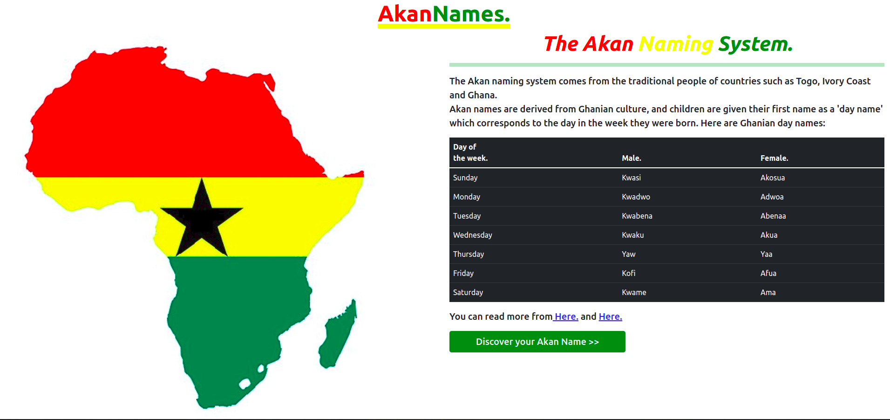
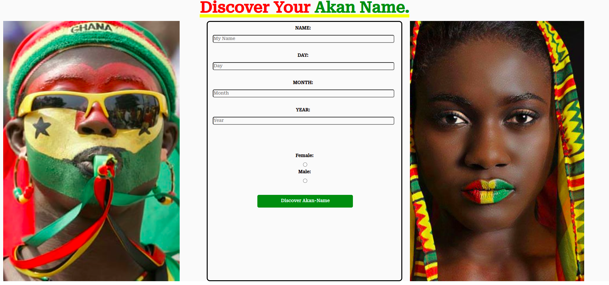

# akan-name-generator

##### By Florence Wambui.

## Table of Content

- [Description](#description)
- [Technology Used](#technology-used)
- [Reference](#reference)
- [Authors Info](#author-Info)

## Description

This is  a website that gives an overview of the Akan naming tradition as used in Ghana. A user is able to learn of the different Akan names corresponding to given days of the week and is able to generate an Akan name depending on inputed birthday dates.

### Apperance.

**Landing page**

**Discover Name Page**

**Live Page**

> This is the link to the live page: https://flowambui.github.io/akan-name-generator/

### Requirements

- Access to a desktop or laptop.
- An access to the Internet.

## Technology Used

- HTML - which is used to build the structure of the pages.

- CSS - which is used to style the web pages.

- Bootstrap - which is used in styling.

- Javascript - which is used to return the birthdate values corresponding to the Akan given name.

## Reference

- MDN Documents.
- W3 Schools.
- You-Tube Tutorials.

## Authors Info

Email Address- [Florence Wambui.](mailto:gflorencewambui@gmail.com?subject=[GitHub]%20Source%20Florence)

Copyright (c) [2022] Florence Wambui.
